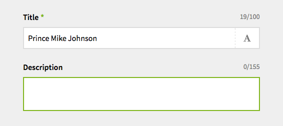

**Deprecated: As of Kirby 2.2 this is included in Kirby**

# Kirby input field replacement

Replacement for Kirby’s input field.

## What is it?

The replacement input field adds a character counter that indicates whether a field is inside of a min/max range provided in the blueprint.

## Why use it?

It gives panel users a better indication of input length restraints that have been put in place.



## Installation

Place the `input` folder in `/site/fields`.

`git submodule add https://github.com/iksi/KirbyInputField.git site/fields/input`
Or place a folder called `input` in `/site/fields` with the repository’s contents.

## Usage

You can use it immediately and it makes use of indicated min/max values in validate.

```YAML
title:
  label: Title
  type: text
  validate:
    max: 100
```

## Author
Iksi, <http://www.iksi.cc/>
